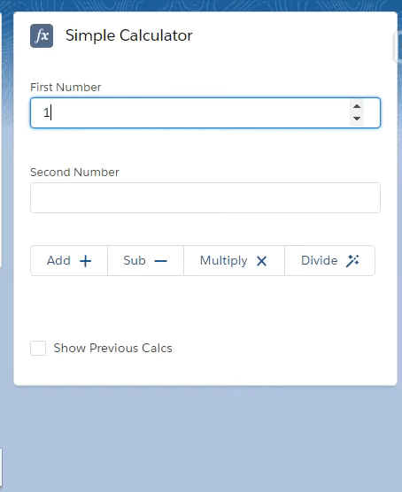

# Simple-Calculator-LWC

This LWC component takes input from user and perform basic arithmetic operations.
Calls to the operations have been provided from button clicks.
And this component stores and displays the previous values calculated

